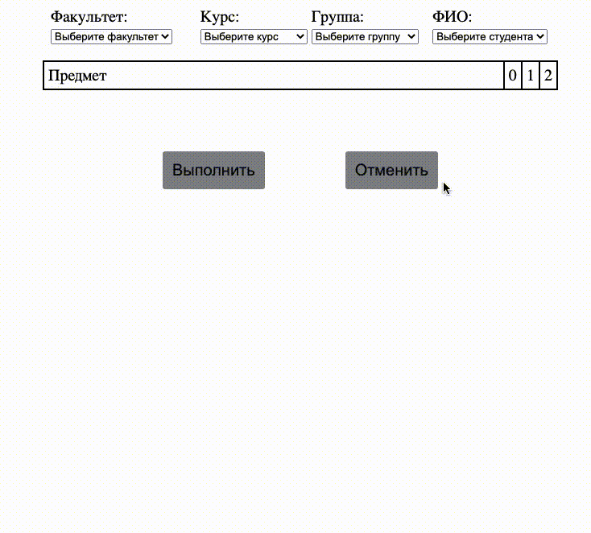

# About repository
This project developed in order to apply all my theoretical knowledge on frontend development in practice.
# Tools
## HTML and CSS
***Pug*** - for HTML development. ***SASS preprocessor*** - for CSS development, styles code developed using BEM methodology.  
Also completed adaptive and fluid development using media queries.
## JS
Source code of application is written in ***TypeScript***. During the development , I tried to use ***SOLID*** principles and main OOP concepts. 
I chose ***MVC pattern*** to organize the application architecture. To create a cross-platform application used SlimSelect library.
## Unit testing
Developed Unit-tests with ***Jest framework***. In test cases handle asynchronous code and functions that directly manipulates the DOM.
## Documentation
Some parts of code have documented comments according to the ***JSDocs standard***.
## Build
To buid Pug and SCSS used ***Gulp***, to compail TypeScript used ***Webpack***, to create code that supports ES5 and for the correct work of Jest used ***Babel***.  
To install the application use:  
*$ git clone https://github.com/morozov312/XML-HTML-Parser && npm i*  
To run tests:  
*$ npm test*  
To build:  
*$ npm build*  
# Example

 

