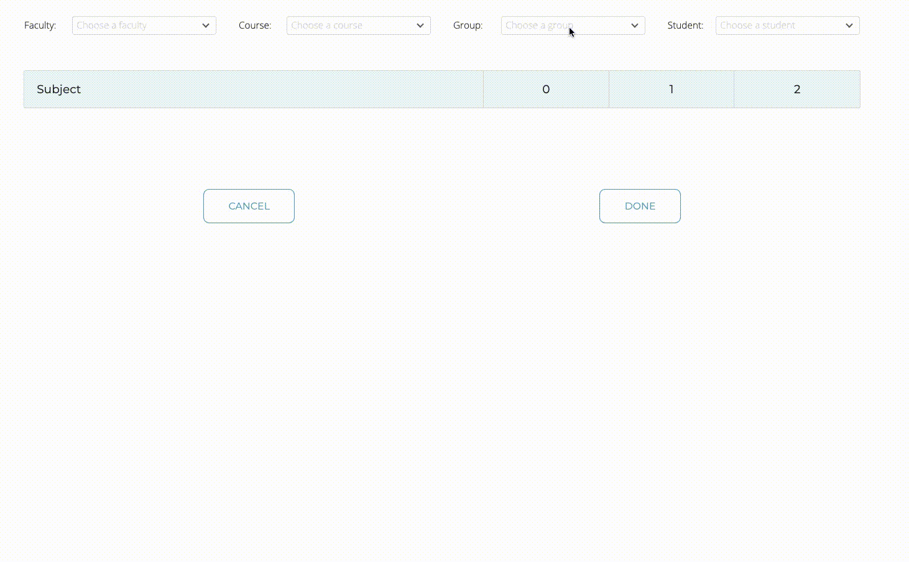

# About repository
This project is another practice in JS. Also this is my first experience of using XML and HTML DOM.  
Programm use ajax request's - hence you need to run it in a server environment.  
This application was developed in a limited time, therefore it has a debatable solution with large loops, which probably can be optimized.
# How it works?
In fields "faculty" and "group" parse all information from XML database, then you can choose any options and the rest of the fields will adjust to them.  
# Example

 

